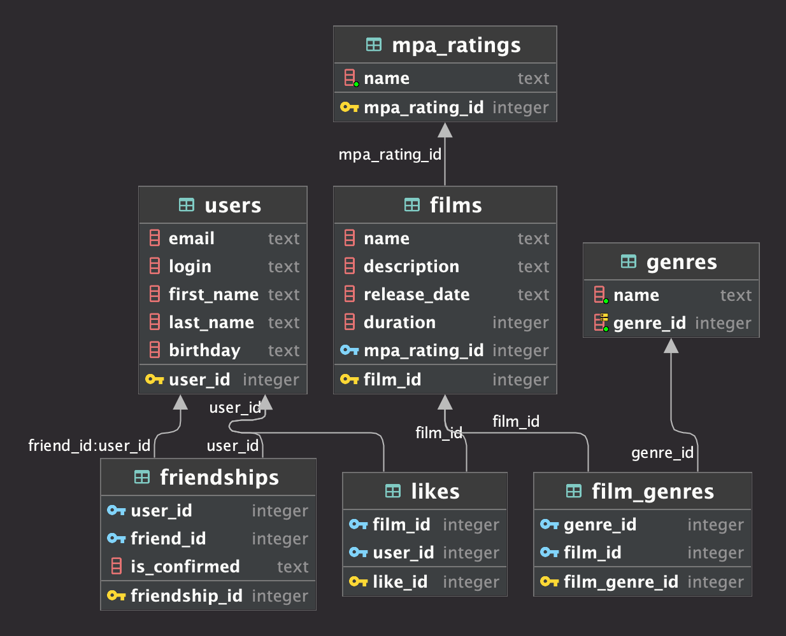

# java-filmorate

Template repository for Filmorate project.

# Диаграмма базы данных



# Примеры запросов

### Получение списка всех фильмов

```sql
SELECT *
FROM films;
```

| film\_id | name                                  | description                                                                                                                                       | release\_date | duration | mpa\_rating\_id |
|:---------|:--------------------------------------|:--------------------------------------------------------------------------------------------------------------------------------------------------|:--------------|:---------|:----------------|
| 1        | У холмов есть глаза                   | Путешествуя по Америке в доме на колесах, семейство Картеров, попав в аварию, оказывается в таинственной ядерной зоне, отрезанной от цивилизации. | 2006-03-10    | 107      | 1               |
| 2        | Иван Васильевич меняет профессию<br/> | Советская фантастическая комедия 1973 года, снятая режиссёром Леонидом Гайдаем по мотивам пьесы Михаила Булгакова «Иван Васильевич»               | 1973-09-17    | 88       | 2               |

### Получение списка всех пользователей

```sql
SELECT *
FROM users;
```

| user\_id | email         | login    | name  | birthday   |
|:---------|:--------------|:---------|:------|:-----------|
| 1        | dumbo1@js.lol | pwnd228  | Игорь | 1991-02-29 |
| 2        | dumbo2@js.lol | pwnd1488 | Стас  | 1997-09-32 |
| 3        | tryp@mail.ru  | tryp     | Кочан | 1898-13-42 |

### Получение списка MPA рейтинга

```sql
SELECT *
FROM mpa_ratings;
```

| mpa\_rating\_id | name  |
|:----------------|:------|
| 1               | G     |
| 2               | PG    |
| 3               | PG-13 |
| 4               | R     |
| 5               | NC-17 |

### Получение списка жанров

```sql
SELECT *
FROM genres;
```

| name           | genre\_id |
|:---------------|:----------|
| Комедия        | 1         |
| Драма          | 2         |
| Мультфильм     | 3         |
| Триллер        | 4         |
| Документальный | 5         |
| Боевик         | 6         |

### Получение списка фильмов и их жанров

```sql
SELECT f.name,
       g.name
FROM films f
         LEFT JOIN film_genres fg ON f.film_id = fg.film_id
         LEFT JOIN genres g ON fg.genre_id = g.genre_id;
```

| name                                  | name    |
|:--------------------------------------|:--------|
| У холмов есть глаза                   | Драма   |
| У холмов есть глаза                   | Триллер |
| Иван Васильевич меняет профессию<br/> | Боевик  |

### Получение списка популярных фильмов по лайкам

```sql
SELECT f.name,
       count(f.name) likes
FROM films f
         LEFT JOIN likes l ON f.film_id = l.film_id
GROUP BY f.name
ORDER BY count(f.name) DESC;
```

| name                                  | likes |
|:--------------------------------------|:------|
| У холмов есть глаза                   | 2     |
| Иван Васильевич меняет профессию<br/> | 1     |

### Получение всего списка друзей

```sql
SELECT *
FROM users
         LEFT JOIN friendships f ON users.user_id = f.friend_id;
```

| user\_id | email         | login    | name  | birthday   | friendship\_id | user\_id | friend\_id | is\_confirmed |
|:---------|:--------------|:---------|:------|:-----------|:---------------|:---------|:-----------|:--------------|
| 1        | dumbo1@js.lol | pwnd228  | Игорь | 1991-02-29 | 2              | 2        | 1          | true          |
| 1        | dumbo1@js.lol | pwnd228  | Игорь | 1991-02-29 | 3              | 3        | 1          | true          |
| 2        | dumbo2@js.lol | pwnd1488 | Стас  | 1997-09-32 | 1              | 1        | 2          | true          |
| 2        | dumbo2@js.lol | pwnd1488 | Стас  | 1997-09-32 | 4              | 3        | 2          | true          |
| 3        | tryp@mail.ru  | tryp     | Кочан | 1898-13-42 | 5              | 1        | 3          | true          |
| 3        | tryp@mail.ru  | tryp     | Кочан | 1898-13-42 | 6              | 2        | 3          | true          |

### Получение списка друзей Игоря

```sql
SELECT *
FROM users
WHERE user_id IN (SELECT f.friend_id
                  FROM users u
                           JOIN friendships f ON u.user_id = f.user_id
                  WHERE u.user_id = 1);
```

| user\_id | email         | login    | name  | birthday   |
|:---------|:--------------|:---------|:------|:-----------|
| 2        | dumbo2@js.lol | pwnd1488 | Стас  | 1997-09-32 |
| 3        | tryp@mail.ru  | tryp     | Кочан | 1898-13-42 |

### Получение списка общих друзей Игоря и Стаса

```sql
SELECT *
FROM users
WHERE user_id IN
      (SELECT friend_id
       FROM users u
                JOIN friendships f ON u.user_id = f.user_id
       WHERE u.user_id = 1
         AND f.is_confirmed = 'true')
  AND user_id IN
      (SELECT friend_id
       FROM users u
                JOIN friendships f ON u.user_id = f.user_id
       WHERE u.user_id = 2
         AND f.is_confirmed = 'true');
```

| user\_id | email        | login | name  | birthday   |
|:---------|:-------------|:------|:------|:-----------|
| 3        | tryp@mail.ru | tryp  | Кочан | 1898-13-42 |


